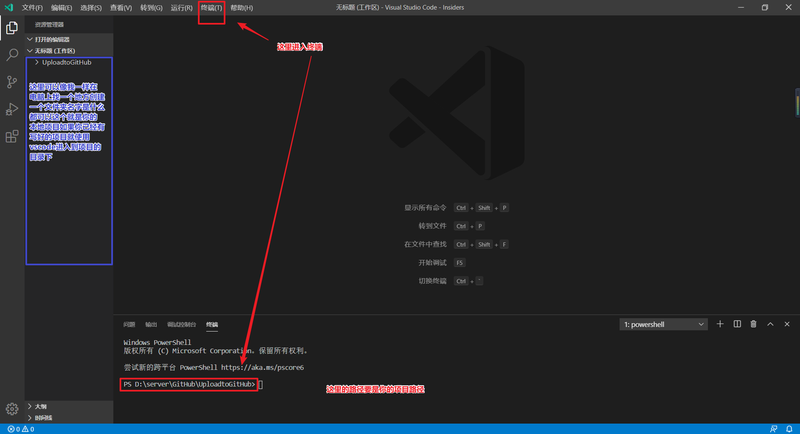
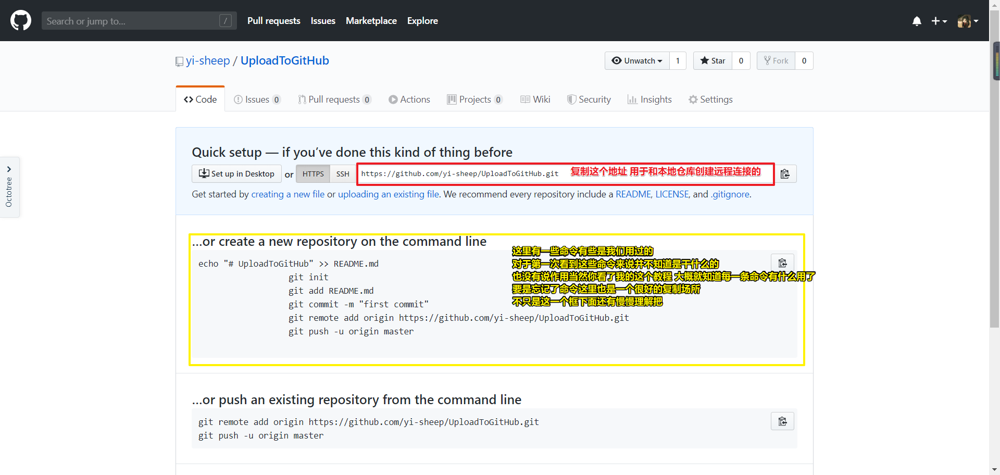

# UploadToGitHub
    上传项目到GitHub
### VSCode
    使用vscode上传有两种方式：

<a href="">纯终端上传</a> 使用命令

<a href="">vscode自身</a> 还是需要使用终端进行初始操作

初始操作：

<a href="#init">初始化本地仓库</a>

<a href="#remote">建立远程连接</a>

- 初始化本地仓库

        这一步是上传的两种方式都需要做的
        
    - 创建GitHub项目
            
            登录自己的GitHub账号，创建一个项目
        
            
            创建项目 看图
        

            进入vscode 打开终端
        

            在终端中使用 git init 初始化/创建本地仓库
        
- 建立远程连接

        这一步也是上传的两种方式都需要做的
    - 查看GitHub的远程连接地址

            创建好一个GitHub项目后会出现这样的一个界面
            复制界面中的地址
        

            进入vscode中 在终端输入命令 
            git remote add origin 你复制的GitHub远程连接地址
            图中其他内容不用看 因为这是按照终端上传截的图
        